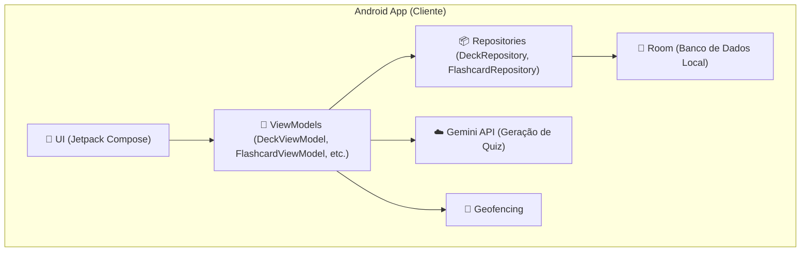

# Trabalho da Disciplina Programação para Dispositivos Móveis

Repositório para o trabalho da disciplina Programação para Dispositivos Móveis do curso de Sistemas de Informação da Universidade Federal de Uberlândia.
###### Por Danilo Plissken, Luiz Fellipe Silva Lima, Eduardo Antonio da Silva, Ótavio Martins Gondim e Rogério Anastácio

 

  

  

## 🧾 Índice

* [ 📊 Diagrama de Arquitetura do Sistema](#-diagrama-de-arquitetura-do-sistema)
* [ 📖 Sobre o Aplicativo](#-sobre-o-aplicativo)
* [ ✅ Funcionalidades](#-funcionalidades)
* [ 🛠️ Tecnologias Utilizadas](#️-tecnologias-utilizadas)
* [ 🚀 Como Executar o Projeto](#-como-executar-o-projeto)
* [ 🔮 Melhorias Futuras](#-melhorias-futuras)

  

## 📊 Diagrama de Arquitetura do Sistema

 

[Retornar ao 🧾Índice](#-%C3%ADndice)

📖 Sobre o Aplicativo

V.C. Study é um aplicativo de flashcards para Android, desenvolvido em Kotlin com Jetpack Compose. O aplicativo oferece uma experiência de estudo completa e inteligente, permitindo a criação de baralhos e flashcards de diferentes tipos. Um dos grandes diferenciais do V.C. Study é a integração com a API do Gemini, que possibilita a geração automática de baralhos com flashcards de temas definidos pelo usuário, tornando o aprendizado mais dinâmico e interativo.
Além disso, o aplicativo conta com um sistema de geofencing, que permite associar baralhos a locais específicos, incentivando o estudo contextualizado.

 

[Retornar ao 🧾Índice](#-%C3%ADndice)

✅ Funcionalidades

  ✅ Criação e Gerenciamento de Baralhos: Crie, edite e exclua baralhos de estudo.
  ✅ Criação de Flashcards: Adicione flashcards aos seus baralhos.
  ✅ Geração de Quizzes com IA: Utilize a API do Gemini para gerar quizzes automaticamente a partir dos seus flashcards.
  ✅ Geofencing: Associe baralhos a locais específicos e receba notificações para estudar quando estiver no local.
  ✅ Interface Moderna: Interface de usuário construída com Jetpack Compose, proporcionando uma experiência fluida e agradável.
  ✅ Persistência de Dados: Todos os seus baralhos e flashcards são salvos localmente utilizando o Room.
  
 

[Retornar ao 🧾Índice](#-%C3%ADndice)

🛠️ Tecnologias Utilizadas

  Kotlin: Linguagem de programação oficial para o desenvolvimento Android.
  Jetpack Compose: Kit de ferramentas moderno para a criação de interfaces de usuário nativas do Android.
  Room: Biblioteca de persistência para criar um banco de dados local.
  ViewModel: Para gerenciar os dados da interface de forma consciente do ciclo de vida.
  Navigation Compose: Para lidar com a navegação entre as telas do aplicativo.
  Coroutines & Flow: Para gerenciar tarefas assíncronas e programação reativa.
  Gemini API: Para a geração de quizzes com inteligência artificial.
  Geofencing API: Para criar e monitorar áreas geográficas.

 

[Retornar ao 🧾Índice](#-%C3%ADndice)

🚀 Como Executar o Projeto

Para compilar e executar este projeto localmente, siga os passos abaixo:

    Clone o Repositório
    Bash

git clone [https://www.dio.me/articles/enviando-seu-projeto-para-o-github](https://www.dio.me/articles/enviando-seu-projeto-para-o-github)

Configuração da API do Gemini
    Vá até o Google AI Studio.
    Crie uma nova chave de API.
    Abra o arquivo local.properties do projeto e adicione a seguinte linha, substituindo SUA_API_KEY pela chave que você gerou:
   Properties
        GEMINI_API_KEY="SUA_API_KEY"
    Abra no Android Studio
        Abra o projeto no Android Studio.
        O Gradle irá sincronizar e baixar todas as dependências necessárias.
        Execute o aplicativo em um emulador ou dispositivo físico.

 

[Retornar ao 🧾Índice](#-%C3%ADndice)

Retornar ao 🧾Índice
