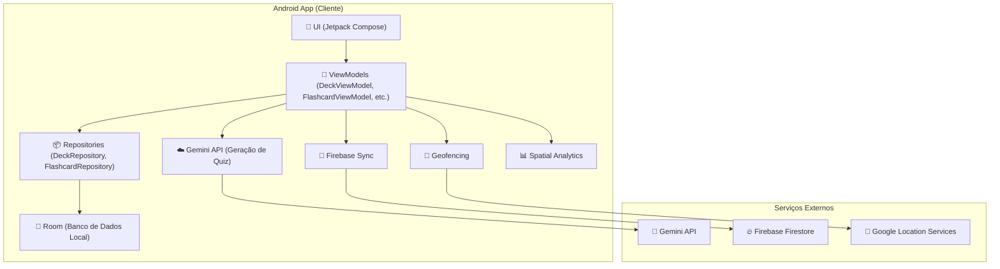
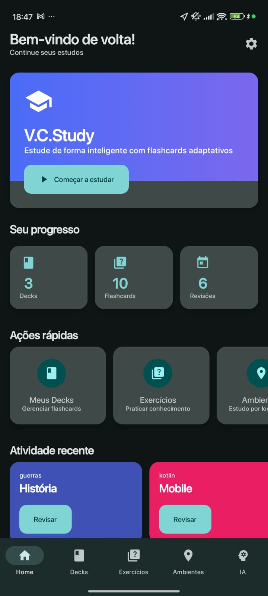
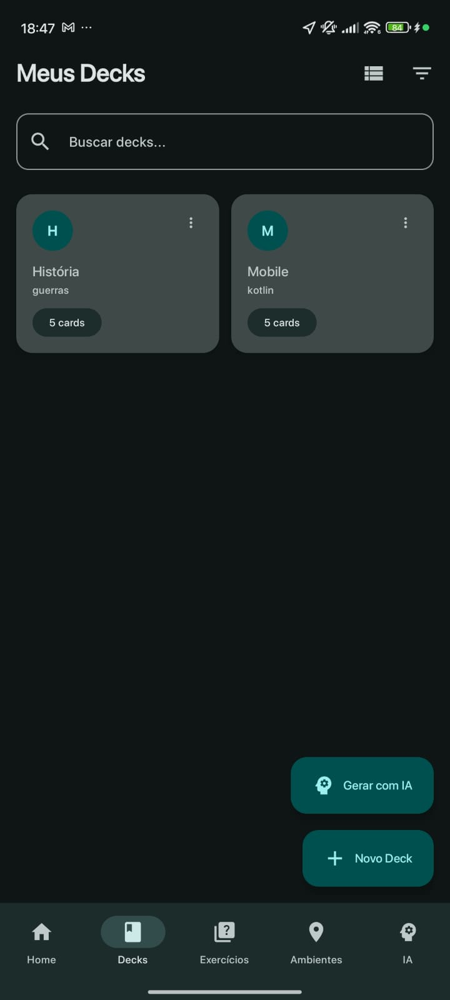
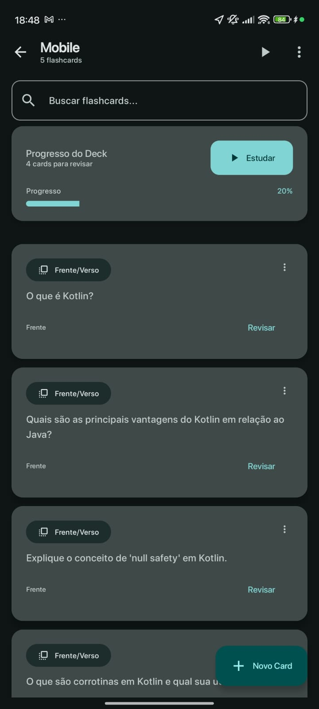
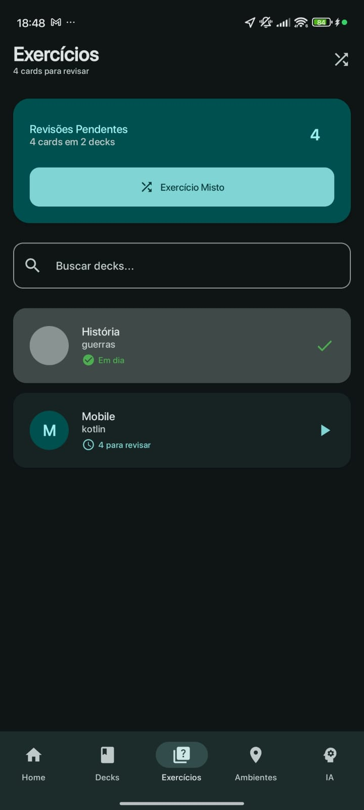
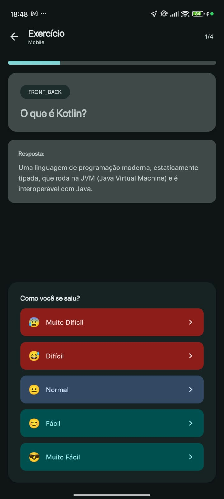
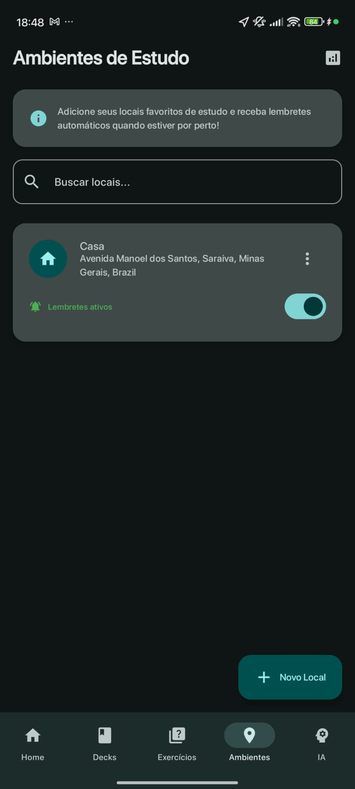
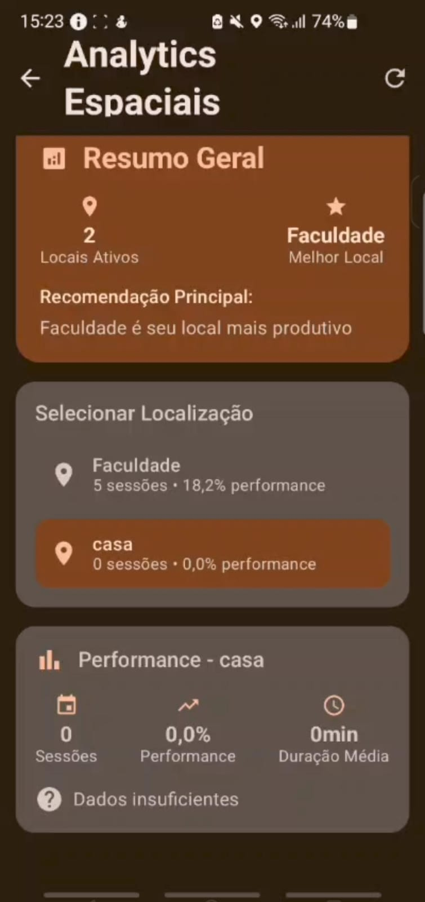

<div align="center">

</div>

# Trabalho da Disciplina Programação para Dispositivos Móveis

Repositório para o trabalho da disciplina Programação para Dispositivos Móveis do curso de Sistemas de Informação da Universidade Federal de Uberlândia.
###### Por Arthur Henrique Cavalcante Rosa, Augusto de Faria Pereira, Danilo Eduardo Fonseca Souza, Luiz Fellipe Silva Lima, Eduardo Antonio da Silva, Ótavio Martins Gondim, Patrícia Fernandes Dornelas e Rogério Anastácio

<br>
<div align="center">
  
</div>


<br><br>

## 🧾 Índice

* [ 📊 Diagrama de Arquitetura do Sistema](#-diagrama-de-arquitetura-do-sistema)
* [ 📖 Sobre o Aplicativo](#-sobre-o-aplicativo)
* [ ✅ Funcionalidades](#-funcionalidades)
* [ 📸 Capturas de Tela do Aplicativo V.C. Study](#-capturas-de-tela-do-aplicativo-vc-study) 
* [ 🛠️ Tecnologias Utilizadas](#️-tecnologias-utilizadas)
* [ 🚀 Como Executar o Projeto](#-como-executar-o-projeto)
* [ 📱 Telas e Navegação](#-telas-e-navegação)
* [ 🧠 Sistema de Repetição Espaçada](#-sistema-de-repetição-espaçada)
* [ 📍 Sistema de Geofencing](#-sistema-de-geofencing)
* [ 🤖 Inteligência Artificial](#-inteligência-artificial)
* [ 📊 Analytics Espaciais](#-analytics-espaciais)

<br><br>

## 📊 Diagrama de Arquitetura do Sistema



<br>

[Retornar ao 🧾Índice](#-%C3%ADndice)

## 📖 Sobre o Aplicativo

**V.C. Study** é um aplicativo de flashcards inteligente para Android, desenvolvido em Kotlin com Jetpack Compose. O aplicativo oferece uma experiência de estudo completa e contextualizada, permitindo a criação de baralhos e flashcards de diferentes tipos com sistema de repetição espaçada.

### 🎯 Principais Diferenciais:

- **🤖 Geração Automática com IA**: Integração com a API do Gemini para geração automática de flashcards e quizzes
- **📍 Estudo Contextualizado**: Sistema de geofencing que associa baralhos a locais específicos
- **📊 Analytics Espaciais**: Análise de performance baseada em localização
- **🔄 Sincronização em Nuvem**: Backup automático dos dados no Firebase
- **🧠 Repetição Espaçada Inteligente**: Algoritmo SM-2 para otimização do aprendizado
- **🎨 Interface Moderna**: Design fluido e responsivo com Jetpack Compose

<br>

[Retornar ao 🧾Índice](#-%C3%ADndice)

## ✅ Funcionalidades

### 📚 **Gestão de Conteúdo**
- ✅ **Criação e Gerenciamento de Baralhos**: Crie, edite e exclua baralhos de estudo com temas personalizados
- ✅ **4 Tipos de Flashcards**: 
  - **Frente e Verso**: Pergunta e resposta tradicional
  - **Múltipla Escolha**: Questões com 4 alternativas
  - **Omissão de Palavras (Cloze)**: Complete as lacunas
  - **Digite a Resposta**: Resposta livre com validação
- ✅ **Suporte Multimídia**: Imagens e áudio nos flashcards
- ✅ **Sistema de Tags e Categorias**: Organização inteligente do conteúdo

### 🧠 **Sistema de Estudo Inteligente**
- ✅ **Repetição Espaçada (SM-2)**: Algoritmo científico para otimizar revisões
- ✅ **Exercícios Adaptativos**: Dificuldade ajustada baseada no desempenho
- ✅ **Exercício Misto**: Combine flashcards de diferentes baralhos
- ✅ **Estatísticas de Progresso**: Acompanhamento detalhado do aprendizado

### 🤖 **Inteligência Artificial**
- ✅ **Geração Automática de Flashcards**: Crie conteúdo automaticamente com IA
- ✅ **Quiz Inteligente**: Geração de perguntas personalizadas por tema
- ✅ **Rotação Inteligente**: Sugestões baseadas em localização e preferências

### 📍 **Sistema de Localização**
- ✅ **Geofencing Avançado**: Notificações automáticas ao entrar em locais específicos
- ✅ **Localizações Favoritas**: Salve e gerencie locais de estudo
- ✅ **Monitoramento em Background**: Serviço de localização contínuo
- ✅ **Notificações Contextuais**: Lembretes inteligentes baseados em localização

### 📊 **Analytics e Relatórios**
- ✅ **Analytics Espaciais**: Performance por localização
- ✅ **Relatórios de Produtividade**: Insights sobre hábitos de estudo
- ✅ **Comparação de Locais**: Identifique seus melhores ambientes
- ✅ **Recomendações Inteligentes**: Sugestões baseadas em dados

### 🔄 **Sincronização e Backup**
- ✅ **Sincronização Firebase**: Backup automático na nuvem
- ✅ **Sincronização Offline**: Funciona sem conexão
- ✅ **Resolução de Conflitos**: Merge inteligente de dados

### 🎨 **Interface e Experiência**
- ✅ **Design Moderno**: Interface fluida com Material Design 3
- ✅ **Navegação Intuitiva**: Bottom navigation com 5 seções principais
- ✅ **Animações Suaves**: Transições elegantes entre telas
- ✅ **Tema Adaptativo**: Suporte a modo claro e escuro
- ✅ **Acessibilidade**: Recursos para usuários com necessidades especiais

<br>

[Retornar ao 🧾Índice](#-%C3%ADndice)


## 📸 Capturas de Tela do Aplicativo V.C. Study

<br>
Veja as capturas das principais telas do aplicativo V.C. Study:

<table style="width: 100%; table-layout: fixed; text-align: center;">
  <tr>
    <td style="width: 12.5%; padding: 10px;">
      <br/>
    </td>
    <td style="width: 12.5%; padding: 10px;">
      <br/>
    </td>
    <td style="width: 12.5%; padding: 10px;">
      <br/>
    </td>
    <td style="width: 12.5%; padding: 10px;">
      <br/>
    </td>
    <td style="width: 12.5%; padding: 10px;">
      <br/>
    </td>
    <td style="width: 12.5%; padding: 10px;">
      <br/>
    </td>
    <td style="width: 12.5%; padding: 10px;">
      <br/>
    </td>
    <td style="width: 12.5%; padding: 10px;">
      <br/>
    </td>
   
  </tr>
  <tr>
    <td><strong>Home</strong></td>
    <td><strong>Decks</strong></td>
    <td><strong>Flash Cards</strong></td>
    <td><strong>Exercicios</strong></td>
    <td><strong>Frente</strong></td>
    <td><strong>Verso</strong></td>
    <td><strong>Localização</strong></td>
    <td><strong>Analise Espaciais</strong></td>
  </tr>
</table>

<br>

Veja o Video com o funcionamento do Aplicativo V.C. Study:


https://github.com/user-attachments/assets/0b3a96eb-3c08-46d8-9635-7988ca814268


[Retornar ao 🧾Índice](#-%C3%ADndice)

## 🛠️ Tecnologias Utilizadas

### **🏗️ Arquitetura e Padrões**
- **MVVM (Model-View-ViewModel)**: Separação clara de responsabilidades
- **Repository Pattern**: Abstração da camada de dados
- **Dependency Injection**: Gerenciamento de dependências
- **Clean Architecture**: Código organizado e testável

### **📱 Desenvolvimento Android**
- **Kotlin**: Linguagem oficial para Android
- **Jetpack Compose**: UI moderna e declarativa
- **Navigation Compose**: Navegação entre telas
- **ViewModel & LiveData**: Gerenciamento de estado
- **Coroutines & Flow**: Programação assíncrona e reativa
- **Room**: Banco de dados local SQLite

### **☁️ Serviços e APIs**
- **Google Gemini API**: Geração de conteúdo com IA
- **Firebase Firestore**: Sincronização em nuvem
- **Google Location Services**: Geofencing e localização
- **FusedLocationProviderClient**: Localização precisa
- **Google Play Services**: Integração com serviços Google

### **🎨 UI/UX**
- **Material Design 3**: Design system do Google
- **Material Icons**: Ícones consistentes
- **Custom Components**: Componentes reutilizáveis
- **Responsive Design**: Adaptação a diferentes telas
- **Dark/Light Theme**: Suporte a temas

### **📊 Dados e Persistência**
- **Room Database**: ORM para SQLite
- **Entity Relationships**: Relacionamentos entre tabelas
- **Type Converters**: Conversão de tipos complexos
- **Migration Support**: Atualizações de schema
- **Data Classes**: Modelos de dados imutáveis

### **🔄 Sincronização**
- **Firebase Firestore**: Banco NoSQL em nuvem
- **Real-time Updates**: Sincronização em tempo real
- **Offline Support**: Funcionamento offline
- **Conflict Resolution**: Resolução de conflitos
- **Batch Operations**: Operações em lote

### **📍 Localização**
- **Geofencing API**: Monitoramento de áreas
- **Background Location**: Localização em segundo plano
- **Location Permissions**: Gerenciamento de permissões
- **Geofence Transitions**: Detecção de entrada/saída
- **Notification System**: Notificações contextuais

### **🧠 Inteligência Artificial**
- **Gemini API Integration**: Integração com IA do Google
- **Prompt Engineering**: Otimização de prompts
- **JSON Parsing**: Processamento de respostas
- **Error Handling**: Tratamento de erros robusto
- **Rate Limiting**: Controle de taxa de requisições

<br>

[Retornar ao 🧾Índice](#-%C3%ADndice)

## 🚀 Como Executar o Projeto

### **📋 Pré-requisitos**
- Android Studio Hedgehog (2023.1.1) ou superior
- Android SDK 34 (Android 14)
- Kotlin 1.9.0+
- Gradle 8.10.2+
- Dispositivo Android com API 24+ ou Emulador

### **🔧 Configuração**

#### **1. Clone o Repositório**
```bash
git clone https://github.com/seu-usuario/vc-study.git
cd vc-study
```

#### **2. Configuração da API do Gemini**
1. Acesse o [Google AI Studio](https://makersuite.google.com/app/apikey)
2. Crie uma nova chave de API
3. Abra o arquivo `local.properties` na raiz do projeto
4. Adicione a chave:
```properties
GEMINI_API_KEY="SUA_API_KEY_AQUI"
```

#### **3. Configuração do Firebase (Opcional)**
1. Acesse o [Firebase Console](https://console.firebase.google.com/)
2. Crie um novo projeto
3. Adicione um app Android
4. Baixe o arquivo `google-services.json`
5. Coloque na pasta `app/`

#### **4. Executar o Projeto**
1. Abra o projeto no Android Studio
2. Aguarde a sincronização do Gradle
3. Execute em um dispositivo ou emulador
4. Conceda as permissões necessárias

### **📱 Permissões Necessárias**
- **Localização**: Para geofencing e analytics espaciais
- **Notificações**: Para lembretes de estudo
- **Internet**: Para sincronização e IA
- **Armazenamento**: Para backup local

<br>

[Retornar ao 🧾Índice](#-%C3%ADndice)

## 📱 Telas e Navegação

### **🏠 Tela Inicial (Home)**
- **Dashboard de Progresso**: Estatísticas de estudo
- **Atividade Recente**: Decks estudados recentemente
- **Ações Rápidas**: Acesso direto às funcionalidades
- **Botão "Revisar"**: Inicia exercícios pendentes

### **📚 Tela de Decks**
- **Lista de Baralhos**: Todos os decks criados
- **Busca e Filtros**: Encontre conteúdo rapidamente
- **Criação de Decks**: Interface intuitiva
- **Estatísticas**: Cards pendentes por deck

### **🎯 Tela de Exercícios**
- **Seleção de Exercícios**: Escolha o tipo de estudo
- **Exercício Misto**: Combine diferentes baralhos
- **Rotação Inteligente**: Sugestões baseadas em IA
- **Configurações**: Personalize sua experiência

### **📍 Tela de Ambientes**
- **Localizações Favoritas**: Gerencie locais de estudo
- **Geofencing**: Ative/desative monitoramento
- **Analytics Espaciais**: Performance por localização
- **Configurações de Localização**: Raio e preferências

### **🤖 Tela de IA Assistente**
- **Chat Interativo**: Converse com Viber.AI
- **Geração de Conteúdo**: Crie flashcards automaticamente
- **Quiz Inteligente**: Perguntas personalizadas
- **Ações Rápidas**: Comandos pré-definidos

### **📊 Tela de Analytics Espaciais**
- **Resumo Geral**: Visão completa do desempenho
- **Comparação de Locais**: Identifique melhores ambientes
- **Relatórios Detalhados**: Insights profundos
- **Recomendações**: Sugestões baseadas em dados

<br>

[Retornar ao 🧾Índice](#-%C3%ADndice)

## 🧠 Sistema de Repetição Espaçada

### **📈 Algoritmo SM-2**
O V.C. Study implementa o algoritmo SM-2 (SuperMemo 2) para otimizar o aprendizado:

- **Intervalos Crescentes**: Tempo entre revisões aumenta progressivamente
- **Fator de Facilidade**: Ajusta dificuldade baseada no desempenho
- **Qualidade de Resposta**: Sistema de 1-5 para avaliação
- **Revisão Automática**: Próxima data calculada automaticamente

### **🎯 Tipos de Exercícios**
1. **Revisão Pendente**: Cards que precisam ser revisados
2. **Novos Cards**: Conteúdo ainda não estudado
3. **Reaprendizado**: Cards que falharam na revisão
4. **Exercício Misto**: Combinação de diferentes tipos

### **📊 Métricas de Acompanhamento**
- **Taxa de Acerto**: Percentual de respostas corretas
- **Tempo Médio**: Velocidade de resposta
- **Consistência**: Regularidade nos estudos
- **Progresso**: Evolução ao longo do tempo

<br>

[Retornar ao 🧾Índice](#-%C3%ADndice)

## 📍 Sistema de Geofencing

### **🎯 Funcionalidades**
- **Monitoramento Contínuo**: Detecta entrada/saída de áreas
- **Notificações Inteligentes**: Lembretes contextuais
- **Localizações Personalizadas**: Crie suas próprias áreas

### **🔧 Configuração**
1. **Adicionar Localização**: Toque no botão "+" na tela de Ambientes
2. **Definir Coordenadas**: Use GPS ou mapa interativo
3. **Configurar Raio**: Escolha o tamanho da área
4. **Ativar Geofencing**: Habilite o monitoramento
5. **Definir Preferências**: Tipos de cards preferidos

### **📱 Notificações**
- **Entrada na Área**: Lembrete para estudar
- **Sugestões Inteligentes**: Cards baseados na localização
- **Rotação Inteligente**: Conteúdo otimizado por ambiente
- **Histórico**: Registro de sessões por localização

<br>

[Retornar ao 🧾Índice](#-%C3%ADndice)

## 🤖 Inteligência Artificial

### **🧠 Gemini API Integration**
- **Geração de Flashcards**: Crie conteúdo automaticamente
- **Quiz Inteligente**: Perguntas personalizadas por tema

### **🎯 Tipos de Geração**
1. **Frente e Verso**: Perguntas e respostas tradicionais
2. **Múltipla Escolha**: Questões com 4 alternativas
3. **Omissão de Palavras**: Complete as lacunas
4. **Digite a Resposta**: Resposta livre com validação

<br>

[Retornar ao 🧾Índice](#-%C3%ADndice)

## 📊 Analytics Espaciais

### **📈 Métricas Disponíveis**
- **Performance por Localização**: Taxa de acerto por ambiente
- **Sessões por Local**: Quantidade de estudos por lugar
- **Tempo Médio de Resposta**: Velocidade por localização
- **Consistência**: Regularidade nos diferentes ambientes

### **🎯 Insights Inteligentes**
- **Melhor Local de Estudo**: Identifique seu ambiente ideal
- **Recomendações**: Sugestões baseadas em dados
- **Comparação**: Analise diferentes locais
- **Tendências**: Evolução do desempenho

### **📊 Relatórios**
- **Resumo Geral**: Visão completa do desempenho
- **Análise Detalhada**: Insights profundos por localização
- **Gráficos Interativos**: Visualização de dados
- **Exportação**: Compartilhe seus resultados

<br>

[Retornar ao 🧾Índice](#-%C3%ADndice)

## 🎨 Design e Experiência do Usuário

### **🎯 Princípios de Design**
- **Material Design 3**: Seguindo as diretrizes do Google
- **Acessibilidade**: Suporte a leitores de tela
- **Responsividade**: Adaptação a diferentes telas
- **Consistência**: Padrões visuais uniformes

### **🌈 Temas e Personalização**
- **Modo Claro/Escuro**: Adaptação automática
- **Cores Personalizadas**: Paleta baseada em Material Design
- **Tipografia**: Hierarquia clara e legível
- **Ícones**: Material Icons para consistência

### **⚡ Performance**
- **Lazy Loading**: Carregamento otimizado
- **Caching Inteligente**: Dados em cache
- **Animações Suaves**: Transições fluidas
- **Otimização de Memória**: Gerenciamento eficiente

<br>

[Retornar ao 🧾Índice](#-%C3%ADndice)

## 🔧 Configurações Avançadas

### **⚙️ Preferências do Usuário**
- **Notificações**: Configure lembretes personalizados
- **Localização**: Ajuste precisão e frequência
- **Sincronização**: Controle backup automático
- **Privacidade**: Gerencie dados compartilhados

<br>

[Retornar ao 🧾Índice](#-%C3%ADndice)

## 📞 Suporte e Contribuição

### **🐛 Reportar Bugs**
- Use as [Issues do GitHub](https://github.com/seu-usuario/vc-study/issues)
- Inclua logs e passos para reproduzir
- Descreva o comportamento esperado vs atual

### **💡 Sugestões**
- Propostas de novas funcionalidades
- Melhorias na interface
- Otimizações de performance
- Integrações adicionais

### **🤝 Contribuir**
1. Fork o repositório
2. Crie uma branch para sua feature
3. Faça commit das mudanças
4. Abra um Pull Request

<br>

[Retornar ao 🧾Índice](#-%C3%ADndice)

---

<div align="center">
  <p><strong>V.C. Study</strong> - Transformando o aprendizado através da tecnologia</p>
  <p>Desenvolvido pelos alunos de Sistemas de Informação - UFU</p>
</div>
